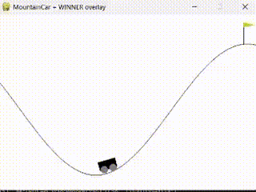

# NEAT Evolution on MountainCar-v0

## Project Description

This project implements **NEAT (NeuroEvolution of Augmenting Topologies)** to train neural networks that learn to solve the classic **MountainCar-v0** environment from Gymnasium. The system evolves both network topology and weights through genetic algorithms, without using backpropagation.

The goal is to teach an agent to drive a small car up a steep hill using pure neuroevolution, comparing two population sizes (50 vs 200) to analyze the impact on training efficiency and solution quality.


---

## Technologies Used

- **Python 3.8+** – main language
- **NEAT-Python** – implementation of the NEAT algorithm
- **Gymnasium** – reinforcement learning environment
- **NumPy** – numerical computations
- **Matplotlib** – visualization and plotting
- **Pygame** – environment rendering

---

## Environment: MountainCar-v0

**Observation Space:** `[position, velocity]`

**Action Space:**
- `0` – push left
- `1` – do nothing
- `2` – push right

**Goal:** Reach the flag at position ≥ 0.5

**Challenge:** The car's engine is too weak to climb the hill directly. The agent must learn to build momentum by rocking back and forth between the hills to gain enough velocity to reach the goal.

---

## Requirements

Make sure you have installed:
- **Python 3.8 or higher**
- **pip** for package management

---

## Installation Instructions

1. **Clone the repository**
```bash
git clone https://github.com/NicolaAnnu/neat-mountaincar.git
cd neat-mountaincar
```

2. **Install dependencies**
```bash
pip install neat-python gymnasium numpy matplotlib pygame
```

---

## Execution Instructions

### Training

Run the training with different population sizes:

```bash
# Population size: 50
python mountain.py --config config.txt --generations 100

# Population size: 200
python mountainwith200popsize.py --config config_200.txt --generations 80
```

**Output files:** `fitness.png`, `fitnesswith200.png`

### Evaluation

Test the trained NEAT genome in the environment with rendering:

```bash
python evaluate.py --genome best_genome_200.pkl --config config_200.txt --episodes 10
```

### Visualization

Generate fitness plots, species evolution, and network topology diagrams:

**Generates:**
- Best and mean fitness plots
- Species evolution over generations
- Network topology visualization

---

## NEAT Configuration

**Configuration files:**
- `config.txt` – for population size 50
- `config-pop-size-200.txt` – for population size 200

---

**Fitness Evolution - Population 50:**


**Fitness Evolution - Population 200:**


---
## NEAT Agent Solving MountainCar-v0


## NEAT Process

The NEAT algorithm works through the following steps:

1. **Mutation:** Add/remove nodes and connections to create topology variations
2. **Crossover:** Combine successful genomes from different parents
3. **Speciation:** Group similar networks to protect innovation and maintain diversity
4. **Fitness Evaluation:** Test each genome on the MountainCar-v0 environment

NEAT starts with minimal networks (simple input-output connections) and gradually complexifies topologies to adapt and evolve behavior without gradient-based optimization.

---

## Experimental Comparisons

The project compares two training configurations:

**Configuration 1:**
- Population: 50
- Generations: 100
- Fitness Threshold: -110

**Configuration 2:**
- Population: 200
- Generations: 100
- Fitness Threshold: -110

**Key Finding:** Larger populations (200) show faster convergence and more stable evolution, while smaller populations (50) exhibit longer stagnation periods but still achieve the goal with sufficient generations.

---

## References

- **NEAT-Python Documentation** – [https://neat-python.readthedocs.io/](https://neat-python.readthedocs.io/)
- **Gymnasium MountainCar** – [https://gymnasium.farama.org/environments/classic_control/mountain_car/](https://gymnasium.farama.org/environments/classic_control/mountain_car/)
- **NEAT Original Paper** (Stanley & Miikkulainen, 2002) – [http://nn.cs.utexas.edu/downloads/papers/stanley.ec02.pdf](http://nn.cs.utexas.edu/downloads/papers/stanley.ec02.pdf)

---

## License

This project is licensed under the **MIT License**, allowing reuse and modification with attribution.

---

## Contributing

Contributions are welcome! Fork the repository, create a feature branch, and submit a Pull Request with clear documentation.

---

## Author

**Nicola Annunziata**  
AI Student

---

## Acknowledgments

- NEAT-Python library maintainers
- Gymnasium / OpenAI Gym community
- Kenneth O. Stanley for the NEAT algorithm